# Taskmaster

**Task Master is an android application to manage daily tasks built by android studio.**
**Home page**

-  image to mock the “my tasks” view, and buttons at the bottom of the page to allow going to the “add tasks” and “all tasks” page.

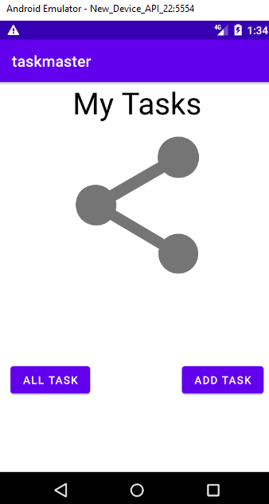

**All Tasks Page**

- The all tasks page just have an image with a back button.

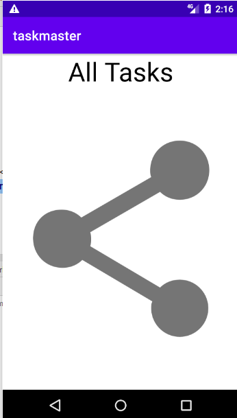

**Add Task page**

- On the “Add a Task” page, allow users to type in details about a new task, specifically a title and a body. When users click the “submit” button, show a “submitted!” label on the page.

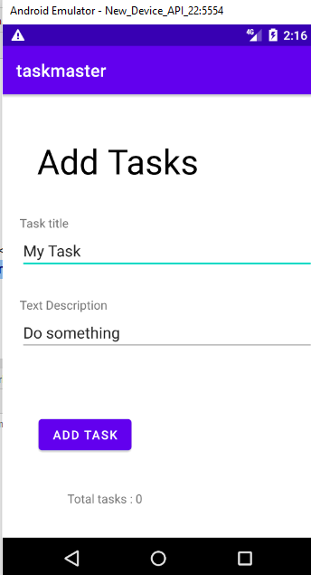   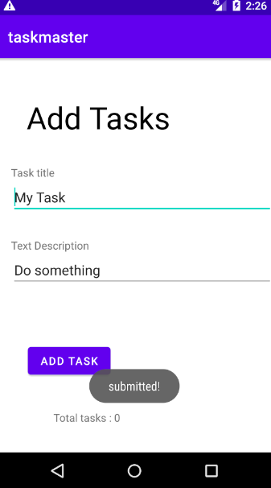

# Lab27 :

- **Homepage**

- homepage with three buttons Lab,Reading and Code Challenge Also Settings button ,when you press in settings button you will go to settings  page, and once the user has entered their username, it should display “{username}’s tasks” above the three task buttons.

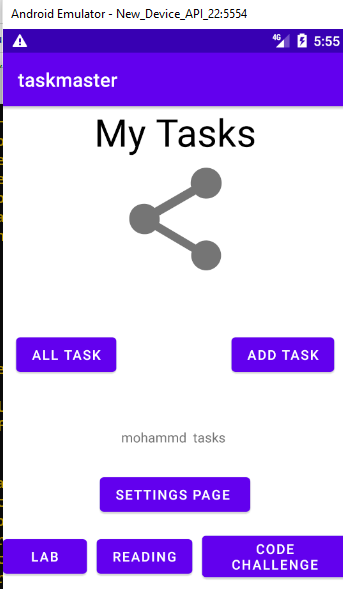      

- **settings  page**

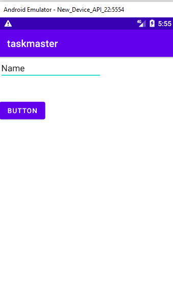   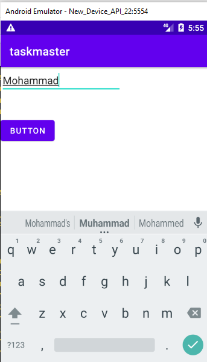

**Task Detail Page** 

- each page have taske come from button  hardcoded in home page
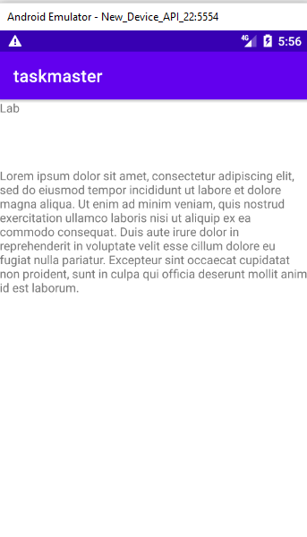  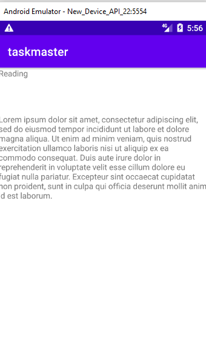  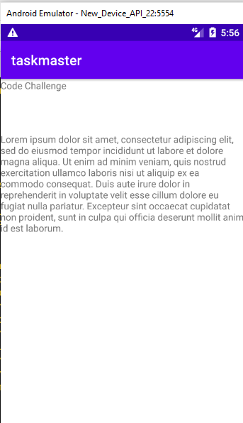

# Lab28 :
- using a RecyclerView to displaying Task data

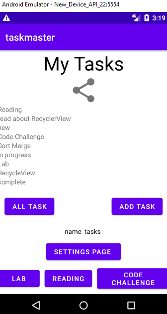
