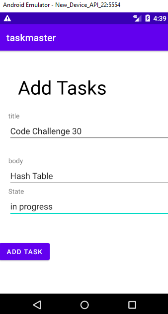
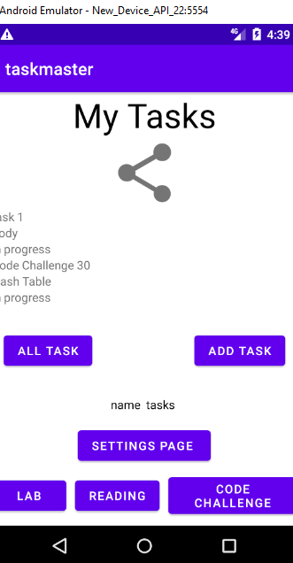
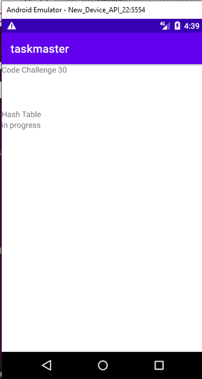
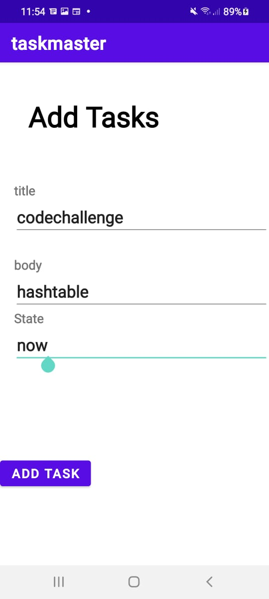
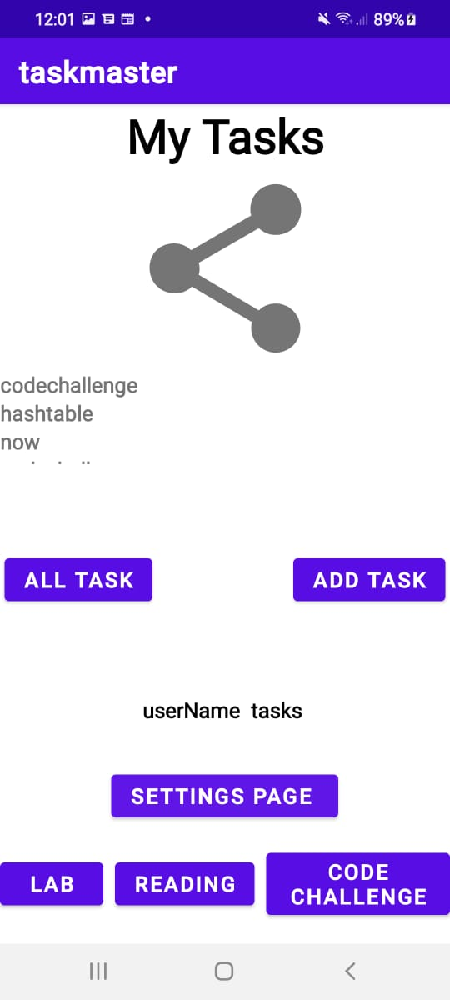
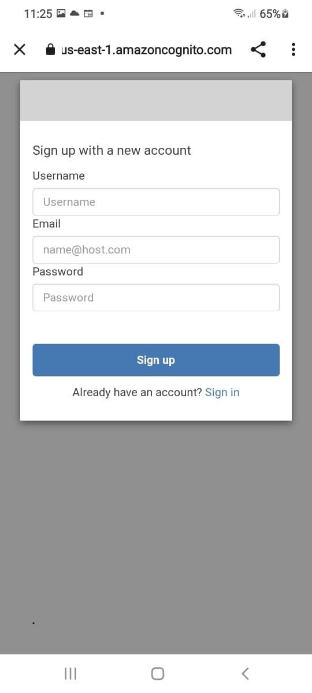
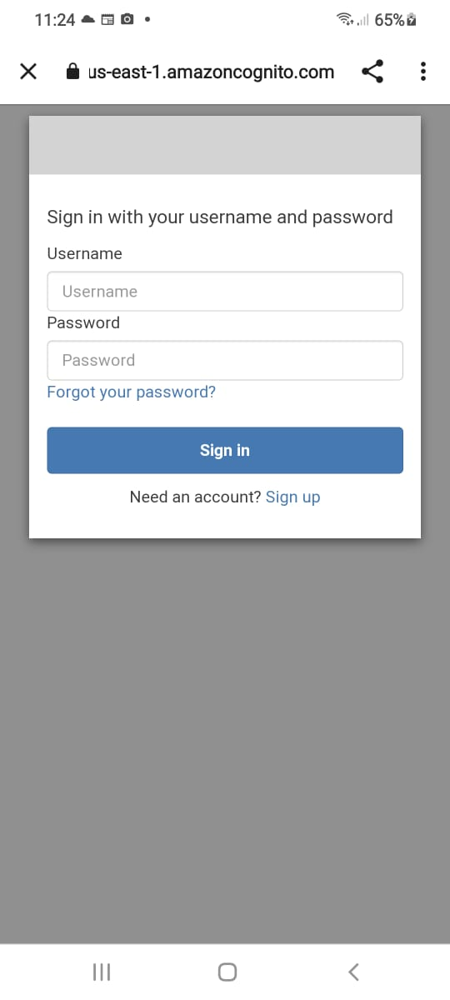
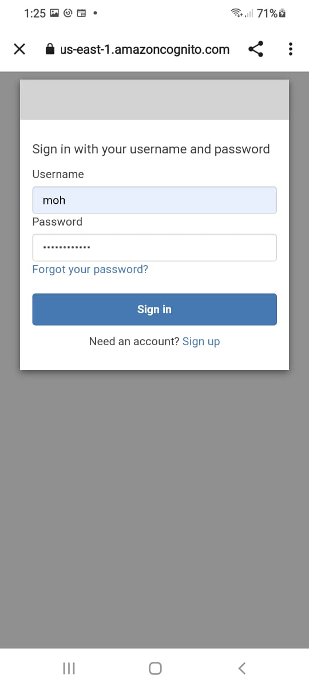
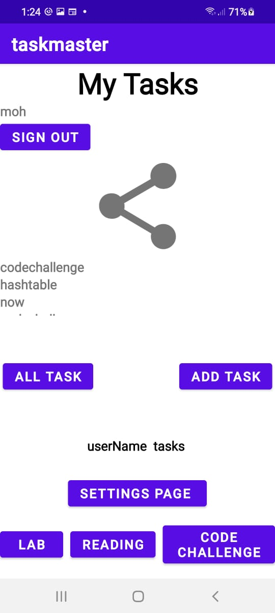

# Taskmaster


**Task Master is an android application to manage daily tasks built by android studio.**
**Home page**

-  image to mock the “my tasks” view, and buttons at the bottom of the page to allow going to the “add tasks” and “all tasks” page.


**All Tasks Page**

- The all tasks page just have an image with a back button.


**Add Task page**

- On the “Add a Task” page, allow users to type in details about a new task, specifically a title and a body. When users click the “submit” button, show a “submitted!” label on the page.


   


# Lab27 :

- **Homepage**


- homepage with three buttons Lab,Reading and Code Challenge Also Settings button ,when you press in settings button you will go to settings  page, and once the user has entered their username, it should display “{username}’s tasks” above the three task buttons.


      


- **settings  page**

   


**Task Detail Page** 


- each page have taske come from button  hardcoded in home page
    


# Lab28 :
- using a RecyclerView to displaying Task data


# Lab 29
- Add task page



- Home Page



- Detail Page



# Lab 31
# Espresso Testing

```java
  @Test public void testBtnAddTaskAndAllTask(){

        onView(withId(R.id.addTask)).perform(click());
        Espresso.pressBackUnconditionally();
        onView(withId(R.id.allTask)).perform(click());
        

    }
```
- in this test , we test the addTask button and allTask button in Home Page
- Home Page


# Lab 32

- AWS Amplify is a set of tools and services that can be used together or on their own, to help front-end web and mobile developers build scalable full stack applications, powered by AWS. With Amplify, you can configure app backends and connect your app in minutes, deploy static web apps in a few clicks, and easily manage app content outside the AWS console.


* Add Task  Page


* Home  Page




# Lab 36

- Sign up page

 

- Sign in page
       

- Home Page 

 